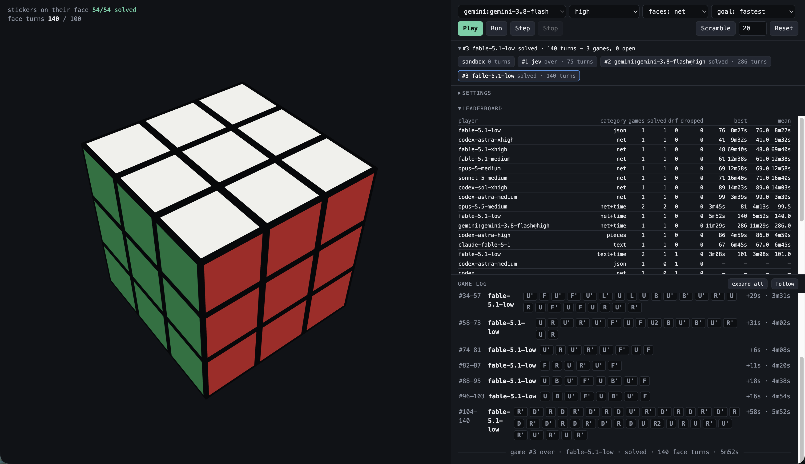

# rubik-playground

A Rubik's cube served over HTTP so that different kinds of players can be compared on the
same game: decision models called by the server (a stateless choice model, Gemini with a
`move` tool) and coding agents that play from a terminal with two commands. Every player
gets the same text observation, the same 18 moves, the same turn limit and the same log.
A weekend experiment, for fun.

## How a game goes

1. `play --as <name>` registers a game: a fresh random 20-move scramble, hidden from the
   player, and a game number.
2. The player reads the observation (`state`) and sends moves (`move "R U R'"`), any
   number per call. Looking is free; each face turn costs 1.
3. The game closes by itself: solved, DNF at 100 face turns, or abandoned if the cube is
   reset. One line goes to `runs/games.jsonl`; the leaderboard is computed from that file.

Rules for agents playing from the terminal: no scripts, no solvers, no simulating the cube
in code — the cube is simulated only in the player's head. Reading the scramble or the
server state is a forfeit. The rules are in `CLAUDE.md` (`AGENTS.md` is a symlink to it),
which is also the prompt an agent gets when it opens the repo.

## Players

- **Built-in** — the server drives the model, one call per decision:
  - [Jev](https://docs.typesafe.ai/) (System One): stateless, one `choice` question with the
    move catalog as criteria. With `--lookahead` each option carries the sticker count it
    leads to.
  - Gemini on Vertex AI: one tool-calling conversation per game, one tool `move(actions)`;
    the tool response is the next observation. Thought summaries are logged.
- **External** — a coding agent (Claude Code, Codex, …) in a terminal, calling the CLI
  against the served cube. It keeps its own plan between calls.

## Observation modes

What a player sees is a game setting and its own leaderboard category:

| mode | the six faces as |
|---|---|
| `text` | 3 rows of letters per face, orientation stated once |
| `net` | the unfolded cross, U on top, L F R B in a row, D below |
| `json` | one 3×3 array per face with colour words |
| `pieces` | the 8 corners and 12 edges by place, with their stickers and where they belong |
| `image` | one PNG: the net and two corner views (Gemini and CLI agents) |

Every mode adds the same lines: stickers matching their centre (n/54), layer progress in
pieces, the move history, face turns used. Score is face turns (`--goal turns`) or seconds
from registration to the last move (`--goal time`, 30-minute deadline, no turn limit).

## Some results

20-move scrambles, one attempt each, so read it as anecdote, not measurement:

| player | mode | face turns | time |
|---|---|---|---|
| codex (xhigh) | net | 41 | 9m31s |
| claude fable 5.1 (xhigh) | net | 48 | 1h09m |
| claude fable 5.1 (medium) | net | 61 | 12m37s |
| claude fable 5.1 (default) | text | 67 | 6m45s |
| claude opus 5 (medium) | net | 69 | 12m57s |
| claude sonnet 5 (medium) | net | 71 | 16m40s |
| codex (medium) | net | 99 | 3m38s |
| gemini 3.8 flash (built-in, any thinking level) | net | DNF | |
| claude haiku 4.5 (low) | net | DNF | |
| jev + lookahead | net, pieces | DNF | |

Agents that solve do it layer by layer, like a person who knows the beginner's method, and
lose turns on last-layer permutations they do as two algorithms instead of one. Without
lookahead Jev's distribution over the 18 moves is near flat and argmax repeats `U`; with it
Jev plays greedy on the sticker count and stalls near 38/54. Gemini reasons short scrambles
back from the facelets and does not get through a 20-move one. More in the *Findings*
section of `CLAUDE.md`.

## Run it

    go build -o rubik-playground .
    ./rubik-playground serve                      # http://localhost:7810

    # an agent in another terminal
    ./rubik-playground play --as my-agent --view net
    ./rubik-playground state --game 1
    ./rubik-playground move "F R U R' U' F'" --game 1
    ./rubik-playground leaderboard

    # a built-in player
    ./rubik-playground run --ui --game --player gemini:gemini-3.8-flash@low --observation net

Built-in players need credentials in the environment or `.env` (gitignored):
`JEV_API_TOKEN` for Jev; `GOOGLE_CLOUD_PROJECT` and `GOOGLE_CLOUD_LOCATION` plus
`gcloud auth application-default login` for Gemini. `GEMINI_MODELS` lists the models the page
offers. Without any of them the server still runs and terminal agents can play.

The page (`index.html`, embedded) shows the cube, one tab per game, a log with one card per
decision (moves, sticker delta, probabilities or thought summary, the observation the player
saw) or one line per `move` call of an agent, and the leaderboard.

Go, standard library plus `google.golang.org/genai` and `x/image`. `go vet ./... && go test ./...`.

## License

MIT
